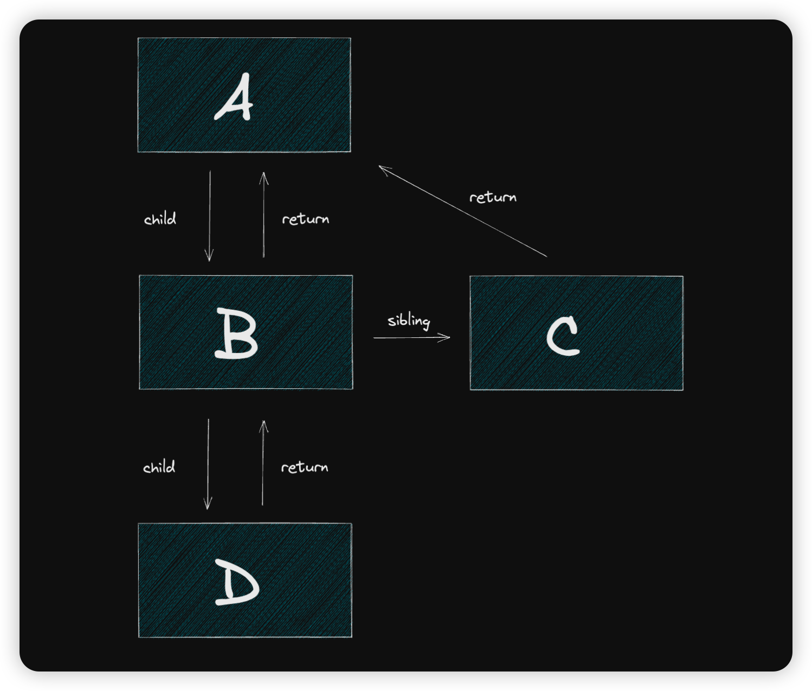

# Fiber

Fiber 也称为协程，它和线程不一样，协程本身并没有并发和并行能力，它需要配合线程，可以理解为一种控制流程让出机制。

> 线程是并发执行的基本单位，一个进程可以包含多个线程，每个线程独立执行。而协程是在单个线程中实现的并发。协程通过协作式的方式在同一个线程中切换执行。

`React Fiber`是一种基于协程理念的实现，用于实现优先级调度和异步渲染。每一个`Fiber`可以被看作一个执行单元，表示组件树中的一个小部分，负责管理自身组件和其渲染过程。

`React Fiber`实现了任务的切片、中断、恢复。使得`React`能够更加高效的处理渲染任务，提升用户体验的应用性能。

## Fiber 树的组织形式

> 虽然叫做 Fiber 树，但其数据结构是个链表。

Fiber 树的组织形式：



这个结构有以下优势：

1. 方便进行各种形式的遍历
2. 可以从任意某个节点出发还原整颗树

正是因为采用这个组织形式，`React Fiber`才能实现任务的切片、中断、恢复。

## Fiber 树的遍历

> Fiber 树采用深度优先遍历

首先从入口开始，删掉一些代码，只关注遍历部分：

```javascript
function workLoop() {
	while (workInProgress !== null) {
		performUnitOfWork(workInProgress)
	}
}

function performUnitOfWork(fiber: FiberNode) {
	const next = beginWork(fiber)

	if (next === null) {
		completeUnitOfFiber(fiber)
	} else {
		workInProgress = next
	}
}
```

遍历工作需要一个指针指向当前工作的 Fiber 节点，`workInProgress`就是这个指针。

首先会执行`beginWork`, 这是一个不断向下的 **递** 的过程,以得到子节点`next`。

当`next === null`时，证明已经到达了叶子节点。

这时候开始执行`completeUnitOfFiber`, 这是一个向上或向右的 **归** 的过程。

### 递

先看 beginWork

```javascript
const beginWork = (wip: FiberNode) => {
	switch (wip.tag) {
		case HostRoot:
			return updateHostRoot(wip)
		case HostComponent:
			return updateHostComponent(wip)
		case HostText:
			return null
		case FunctionComponent:
			return updateFunctionComponent(wip)
	}
}
```

beginWork 只做一个工作，那就是根据 tag 分发逻辑，然后将子节点返回。

这里区分了不同的 Fiber 节点 的处理，暂时不做谈论。

### 归

我们要注意的一点是，`next`指针不应该重复经过同一个节点。假如在向下的过程中经过某个节点，在向上的过程中又出现，那么这个节点就会再次进入 beginWork，陷入死循环。

我们看 completeUnitOfWork 如何解决这个问题：

```javascript
function completeUnitOfFiber(fiber: FiberNode) {
	let node: FiberNode | null = fiber

	do {
		completeWork(node)
		const sibling = node.sibling
		if (sibling !== null) {
			workInProgress = sibling
			return
		}

		node = node.return
		workInProgress = node
	} while (node !== null)
}
```

可以看到 completeUnitOfWork 内部又构建了一层循环，循环向上爬直到顶。如果发现有未处理的 `sibling` 节点，就将这个 `sibling` 节点赋值给 `workInProgress 指针`，结束当前循环，将工作交还给外层的 workLoop 继续循环向下。

### 遍历总结

- 整个遍历由 workLoop 发起，workLoop 会调用 performUnitOfWork，开始深度优先遍历。
- 从根节点开始，循环调 beginWork 向下爬树，直到到达叶子节点。
- beginWork 爬不下去了，证明到达了叶子节点。调用 completeUnitOfWork。
- completeUnitOfWork 循环调用 completeWork 开始向上爬。
- 爬的过程中看节点右侧有无兄弟节点，有则爬兄弟节点，对兄弟节点开始新一轮的 beginWork 循环。
