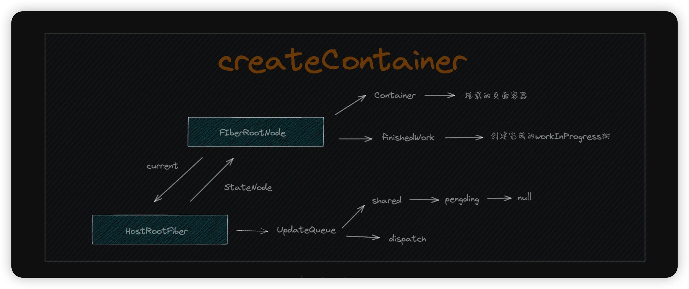

# 树的构建和 Diffing

首先要明确一点，所谓的 Diffing 并不是单独存在的，不是说把树构建完后再进行 Diffing，这么做效率太差了。

而是在树构建过程中进行 Diffing，更好的对老节点进行复用。

## 双缓存树

在 React 中最多会同时存在两颗 Fiber 树：

- current Fiber 树：当前屏幕上显示内容对应的 Fiber 树称为 current Fiber 树
- workInProgress：正在构建的树，主要的工作都在这棵树上

当一次更新发起，首先会先从发起更新的 Fiber 向上爬直到 FiberRootNode 根节点。然后根据 current Fiber 树新建一颗 workInProgress 树，然后构建并遍历这颗 workInProgress 树。

如果构建到一半被打断，current 树还在。如果构建并提交完成，直接把 current 树丢掉，让 workInProgress Fiber 树成为新的 current 树。

## 构建过程（第一次挂载）

从这段代码开始，了解 React 第一次挂载时做了什么？当然这一步只会了解主流程

```javascript
const container = ReactDOM.createRoot(document.getElementById('root'))
container.render(<App />)
```

### 创建容器 createContainer

`ReactDOM.createRoot(document.getElementById('root'))` 实际会调用 `react-reconciler/src/fiberReconciler` 中的 `createContainer`

```javascript
function createContainer(container: Container) {
	const hostRootFiber = new FiberNode(HostRoot, {}, null)
	const root = new FiberRootNode(container, hostRootFiber)
	hostRootFiber.updateQueue = createUpdateQueue()
	return root
}
```

首先创建了两个节点：

1. FiberRootNode: 整个应用的根节点，它包含三个数据：
   - container: 应用挂载的容器
   - finishedWork: 构建完成的 workInProgress 树
   - current: 指向当前的 current 树
2. hostRootFiber: Fiber 树的根节点，从它开始往下才是 FiberNode
   - stateNode：指向 FiberRootNode

接着为`hostRootFiber`创建一个`UpdateQueue`，已供更新时使用。

> `UpdateQueue`是一个对接 React 更新使用的数据，暂不深入了解。

这一步的数据结构如下图所示：



### 首次更新（挂载） updateContainer

`container.render(<App />)` 实际会调用 `react-reconciler/src/fiberReconciler` 中的 `updateContainer`。

```javascript
function UpdateContainer(
	element: ReactElement | null,
	root: FiberRootNode
) {
	const hostRootFiber = root.current
	const update = createUpdate<ReactElement | null>(element)
	enqueueUpdate(
		hostRootFiber.updateQueue as UpdateQueue<ReactElement | null>,
		update
	)
	scheduleUpdateOnFiber(hostRootFiber)
	return element
}
```

首先会根据传入的`reactElement`（`reactElement`是由 babel 将组件转化得来的），创建一个`Update`，然后将这个`Update`加入到之前给`hostRootFiber`创建的`UpdateQueue`中去。

随后调用`scheduleUpdateOnFiber`开始第一次更新（挂载）。

### scheduleUpdateOnFiber

```javascript
function scheduleUpdateOnFiber(fiber: FiberNode) {
	const root = markUpdateFromFiberToRoot(fiber)
	renderRoot(root)
}

function markUpdateFromFiberToRoot(fiber: FiberNode) {
	let node = fiber
	let parent = node.return
	while (parent !== null) {
		node = parent
		parent = parent.return
	}

	if (node.tag === HostRoot) {
		return node.stateNode
	}

	return null
}
```

`scheduleUpdateOnFiber`所做的事情比较简单，从发起更新的节点开始，一路回到根节点`FiberRootNode`，然后开始`renderRoot`。

### renderRoot

```javascript
function prepareFreshStack(root: FiberRootNode) {
	workInProgress = createWorkInProgress(root.current, {})
}

function renderRoot(root: FiberRootNode) {
	// 根据当前current树创建一颗workInProgress树
	prepareFreshStack(root)

	do {
		try {
			workLoop()
			break
		} catch (e) {
			// 错误处理
		}
	} while (true)

	// workInProgress树构建完成后进入Commit流程
	// 暂时忽略
	const finishedWork = root.current.alternate
	root.finishedWork = finishedWork

	commitRoot(root)
}
```

首先会根据当前 current 树创建一颗 workInProgress 树，并开启一个`do...while...`循环去启动`workLoop`。

注意这里的`do...while...`循环条件是 true，当 workLoop 正确执行完时，会正常 break 结束循环，否则会做错误处理，然后接着循环。

### workLoop

```javascript
function workLoop() {
	while (workInProgress !== null) {
		performUnitOfWork(workInProgress)
	}
}

function performUnitOfWork(fiber: FiberNode) {
	const next = beginWork(fiber)
	fiber.memorizeProps = fiber.pendingProps

	if (next === null) {
		completeUnitOfFiber(fiber)
	} else {
		workInProgress = next
	}
}

function completeUnitOfFiber(fiber: FiberNode) {
	let node: FiberNode | null = fiber

	do {
		completeWork(node)
		const sibling = node.sibling
		if (sibling !== null) {
			workInProgress = sibling
			return
		}

		node = node.return
		workInProgress = node
	} while (node !== null)
}
```

workLoop 是一个深度优先遍历的过程，可以分为两个阶段：

1. 向下 **递** 的 beginWork
1. 向上或向右 **归** 的 completeWork

### beginWork

```javascript
const beginWork = (wip: FiberNode) => {
	switch (wip.tag) {
		case HostRoot:
			return updateHostRoot(wip)
		case HostComponent:
			return updateHostComponent(wip)
		case HostText:
			return null
		case FunctionComponent:
			return updateFunctionComponent(wip)
	}
}
```

`beginWork`会根据`Fiber Tag`进行逻辑分发，但主要的目的都是同一个：

根据当前`fiber.alternate.child`，也就是对比`current`树中的`子fiber`与当前的`子reactElement`，生成`子fiber node`。

下面来看一下不同的`Fiber Tag`都是怎么处理的。

#### 1. HostRoot

`HostRoot` 就是指 `HostRootFiber`

下面看看`updateHostRoot`做了什么

```javascript
function updateHostRoot(wip: FiberNode) {
	const baseState = wip.memorizeState
	const updateQueue = wip.updateQueue as UpdateQueue<Element>
	const pending = updateQueue.shared.pending
	updateQueue.shared.pending = null
	const { memorizedState } = processUpdateQueue(baseState, pending)
	wip.memorizeState = memorizedState

	const nextChildren = wip.memorizeState

	reconcileChildren(wip, nextChildren)

	return wip.child
}
```

还记得`updateContainer`的执行吗？在那一步中将传入的`reactElement`作为一个`update`赋值给了`hostRootNode.updateQueue`，以供消费。

现在，就是消费这个`update`的时候。

主要做了以下几件事情：

1. 取得`memorizeState`，作为`baseState`，这时候第一次挂载，应该是`null`。
2. 取得`updateQueue`中待消费的`update`，并将`updateQueue`置空
3. 调用`processUpdateQueue`，消费`update`，取得新的`memorizeState`
4. 在`HostRoot`中，`memorizeState`就是`子react element`
5. 调用`reconcileChildren`协调对比`current`树中的`子fiber`与当前的`子reactElement`，生成`子fiber node`。

为什么说在`HostRoot`中，`memorizeState`就是`子react element`呢？

下面看一下`processUpdateQueue`就能明白。

```javascript
const processUpdateQueue = (baseState, pendingUpdate) => {
	const result = {
		memorizedState: baseState
	}
	if (pendingUpdate !== null) {
		const action = pendingUpdate.action
		if (action instanceof Function) {
			result.memorizedState = action(baseState)
		} else {
			result.memorizedState = action
		}
	}

	return result
}
```

在`updateContainer`的执行中，`react element`作为`action`被赋值给了`updateQueue.shared.pending.action`。

所以`action instanceof Function`这个判断肯定是 `false`，所以传入的`react element`会成为`hostRootFiber`的`memorizedState`，进而作为`子react element`参与下一步的协调。

#### 2. HostComponent

`HostComponent`指的是原生标签，例如`<div></div>`，`<p></p>`...

下面看看`updateHostComponent`做了什么

```javascript
function updateHostComponent(wip: FiberNode) {
	const nextProps = wip.pendingProps
	const nextChildren = nextProps.children
	reconcileChildren(wip, nextChildren)
	return wip.child
}
```

这里首先要知道，我们写的 JSX 会被 babel 转译为`react element`，`子react element`会放在 `props.children`里。

随后在协调中，`react element`转化为`fiber`时，`props`会被赋值给`fiber.pendingProps`，所以在`pendingProps.children`里能取到`子react element`。

所以这里做的事情很简单：

1. 得到`子react element`
2. 调用`reconcileChildren`协调对比`current`树中的`子fiber`与当前的`子reactElement`，生成`子fiber node`。

#### 3. FunctionComponent

`FunctionComponent`指的是函数组件

下面看看`updateFunctionComponent`做了什么

```javascript
function updateFunctionComponent(wip: FiberNode) {
	const nextChildren = renderWithHooks(wip)
	reconcileChildren(wip, nextChildren)
	return wip.child
}
```

简略来讲做了以下事情：

1. 调用函数组件得到`子react element`
2. 调用`reconcileChildren`协调对比`current`树中的`子fiber`与当前的`子reactElement`，生成`子fiber node`。

由于`renderWithHooks`里涉及的逻辑较多，会另开篇幅介绍

// TODO 函数组件

#### 4. HostText

`HostText`指的是文本节点，例如`<div>Hello world</div>`中的`Hello world`就是文本节点。

如果这个`fiber tag`是个`HostText`，证明已经走到了 fiber 树的叶子节点了，没有下一级了，直接返回`null`即可。

### reconcileChildren

不管是什么类型的 fiber，几乎最后都会执行`reconcileChildren`，下面就来看看它做了什么。

```javascript
function reconcileChildren(wip: FiberNode, children?: ReactElement) {
	const current = wip.alternate

	if (current !== null) {
		// update
		wip.child = reconcileChildFibers(wip, current.child, children)
	} else {
		// mount
		wip.child = mountChildFibers(wip, null, children)
	}
}
```
